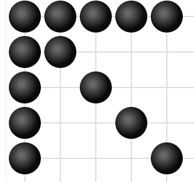
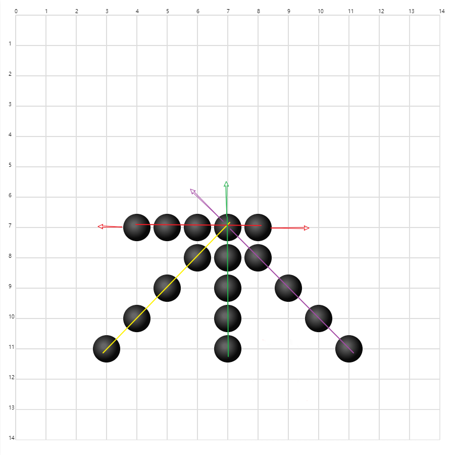

# week 1

[🔙](../)

## 作业

- [x] [完善知识体系](./前端技术.xmind)
- [x] [前端开发目录](./fe-summary.md)
- [x] [01-TicTacToe](./01-TicTacToe/)
- [x] [（选）gobang](./02-gobang/index.html)
- [ ] （选）面向对象这个概念用追溯法写文章
- [x] 总结

## 本周总结

老师说本周的练习是编码能力，这点深有同感。这要求我们面对实际问题时，有解决思路，能将解决思路具体化、逻辑化，之后转化为实际代码。而这个过程中是常常存在问题的，如何将解决问题的方案具体化、有条理有逻辑的展现出来，之后又如何写出正确的代码，这之中都有一定的挑战性。

递归是解决问题的一种好方案，它可以将复杂的问题一次处理一点同时让剩下的任务更简单一点，如此不断重复，直到一个最简单的条件来终止重复过程并得到结果。

TicTacToe 中 `bestChoice` 就是这么一个递归函数，终止的条件即为下一步的某个位置即可取的胜利，否则在可以走的点中任意走一点，并将下一个局面交给递归函数再次处理。


关于练习的五子棋，由于棋盘变大，可以落子的位置很多，直接使用像 TicTacToe 一样直接算到胜利的目前来说是行不通的。因此，我的初步的实现是没有采用递归方案的，仅考虑走在下一步时保证得分最高，对自己最有利，大致思路如下：

**输赢判断**

1. 提前算好所有五子练成线的所有情况，以标准的15*15棋盘而言，虽然数量大，但还是可以完全枚举出来的。无非是所有的横线、所有的竖线、两个方向的斜线，共计 572 种五子成线的可能性。
2. 再用2个数组来统计当前棋盘的局面双方的得分情况，下标为胜利可能性的编号，值默认为0。
3. 每次落子时，遍历胜利可能性的数组。
   1. 如果当前落子的点在某种赢的可能性里面，则统计数据中一方的对方 +1 。
   2. 同时这个点这一方占领后，对对方而言这种赢法的可能性已经配破坏，对方的得分统计数组中直接标记这种赢法失效。
   3. 统计完成后立即检查这种胜利情况的得分是否为 5 ， 若达到5， 这表示当前玩家已经达成了这种赢的局面，游戏结束，否则交由对方下棋

**AI实现**

目标是 5 个子，那么 AI 落子的位置最简单的逻辑就是让连在一起的棋子更可能多。

AI 考虑自己的情况则是

```
自己下一步可以连成 5 的点 > 连成 4 的点 > 连成 3 的点 > 连成2的点 > 随便走一点
```

同时 AI 还需要对我方进行拦截，如果我方已经有2、3、4之类的情况，占据必要位置，对AI也是有利的，这种情况也是

```
玩家下一步可以连成 5 的点 > 连成 4 的点 > 连成 3 的点 > 连成2的点 > 随便走一点
```

因为一个点只可以落子一次，我方有价值的点，如果被AI占据也是对AI有利的

那么AI的实现如下：

1. 初始化一个玩家得分数组、AI 得分数组
2. 初始化一个最大得分、以及对应的落子位置
3. 遍历棋盘上可以落子的点
   1. 遍历每种赢的局面
      1. 若这个点上玩家有赢的可能性，基于当前已经达成的进度，给玩家得分加上一定的数值，如已经已一个子得200，有2个则得分260，有三个则得1000，有4个则得分10000。
      2. 若这个点上有AI赢的可能性，也基于已经达成的进度，给AI得分数组中加上一定的得分。
   2. 检查这点落子的得分是否高于已有得分，若更高，则更新当前最大得分并记录位置
4. 循环结束，AI直接在得分最高的位置落子即可。

代码如下：

```js
if (chessBoard[i][j] === 0) {
    for (let k = 0; k < winedCount; k++) {
        if (winedResult[i][j][k]) {
            // AI 考虑 拦截我方
            switch (player1Win[k]) {
                case 1:
                    playerScore[i][j] += 200;
                    break;
                case 2:
                    playerScore[i][j] += 260;
                    break;
                case 3:
                    playerScore[i][j] += 2000;
                    break;
                case 4:
                    playerScore[i][j] += 10000;
                    break;
                default:
                    break;
            }
            // AI 考虑自己走棋
            switch (player2Win[k]) {
                case 1:
                    AIScore[i][j] += 300;
                    break;
                case 2:
                    AIScore[i][j] += 500;
                    break;
                case 3:
                    AIScore[i][j] += 2500;
                    break;
                case 4:
                    AIScore[i][j] += 20000;
                    break;
                default:
                    break;
            }
        }
    }

    // 顺便找最大分数
    // 从玩家角度考虑
    if (playerScore[i][j] > maxScore) {
        // 玩家得分最高的点 就是AI要占领的点
        maxScore = playerScore[i][j];
        x = i;
        y = j;
    } else if (playerScore[i][j] == maxScore) {
        // 若玩家得分相同 AI 会找对自己更有利的点
        if (AIScore[i][j] >= AIScore[x][y]) {
            x = i;
            y = j;
        }
    }

    // AI 自己的考虑
    if (AIScore[i][j] > maxScore) {
        // 自己最有优势的点
        maxScore = AIScore[i][j];
        x = i;
        y = j;
    } else if (AIScore[i][j] == maxScore) {
        // 自己优势相同则选玩家更好的点， 破坏对手赢的可能性
        if (playerScore[i][j] >= playerScore[x][y]) {
            x = i;
            y = j;
        }
    }
}
```

注意看到，AI自己走的得分和考虑拦截我方的得分是不一样的，通过调节这些数值的大小基本可以控制AI的策略，是更倾向于拦截玩家还是更倾向于自己走棋。

同时这个不同进度下的得分阶梯差距对AI的智能的影响很大。因为本身统计得分是累加的，不同位置得分本身不一样。
以最简单情况为例：

- 左上角第一个点仅有会出现在三种赢的局面中，即横竖斜。
- 而中间的格子，会出现在 `5 + 5 + 5 + 5 = 20` 中赢的局面中。

若落子到上面两个位置，相同的局面下，第一个位置得分仅被累计3次，而中间的位置可以被累计20次。也就是中间的位置价值更高。

以图示意：




**进阶考虑**

出于五子棋的局面考虑，下一步是最有利的情况可能并非一定是对最终胜利最有利的。如仅考虑一步的情况下，可能存在一个点落子之后可以形成三子或四子，但是可能还存在一个位置落子后不能构成三子，但其可以为后续我方提供双三的可能性的点。想到这个问题，对此我的思路是如下这样的

1、假设计算 M 步
1、寻找时不再是仅仅找出下一步得分最高的点，而是得分最高的 TopN
2、对 TopN 的每种情况，再走一步，M递减，再次计算 TopN。
3、对 TopN 加权合并，当M为1时不再继续深入，得出考虑 M 步综合考虑的情况下最优的下一步选择。

不过当前一步和下一步以及再下一步之间如何加权、如何合并，暂时还没良好思路。 尚不完善的代码在 [gobang2](./02-gobang/index2.js) 。
