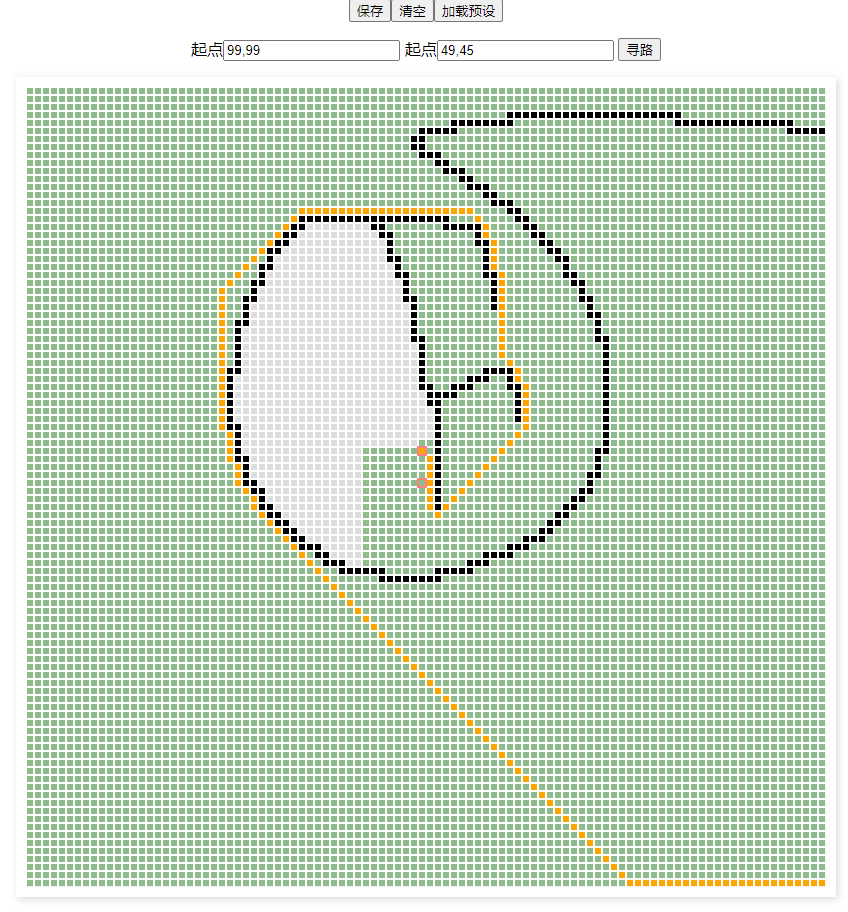
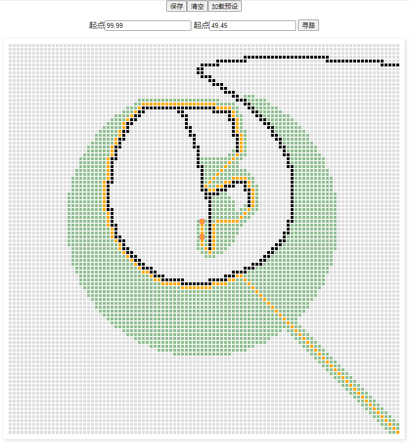
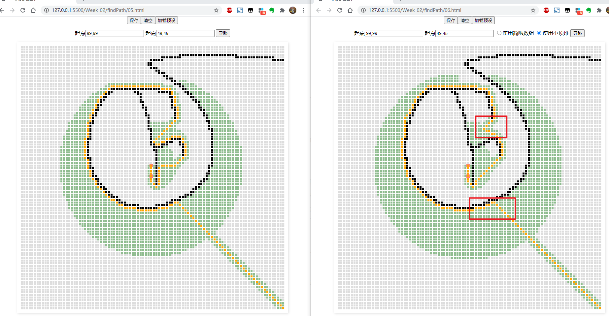
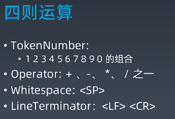
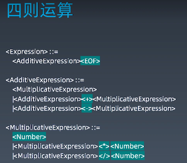
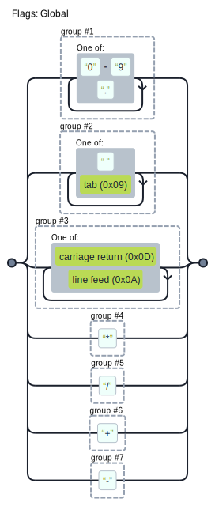

# 学习笔记

- [x] 1. 寻路 | [实现一个地图编辑器](./findPath/01.html)
  - 实现地图编辑效果
  - dom 改为了canvas, 10000 个dom节点 数量是有点大的
  - 新支持了仅点击也可以绘制和清楚，用于精确控制点
- [ ] 2. 寻路 | [广度优先搜索](findPath/02.html)
- [ ] 3. 寻路 | [通过异步编程可视化寻路算法](findPath/03.html)
- [ ] 4. 寻路 | [处理路径问题](findPath/04.html)
- [ ] 5. 寻路 | [启发式搜索（一）](findPath/05.html)
- [ ] 6. 寻路 | [启发式搜索（二）](findPath/06.html)
- [ ] 7. 使用LL算法构建AST | 四则运算
- [ ] 8. 使用LL算法构建AST | [正则表达式](LL/01.html)
- [ ] 9. 使用LL算法构建AST | [LL词法分析](LL/02.html)
- [ ] 10. 使用LL算法构建AST | LL语法分析（一）
- [ ] 11. 使用LL算法构建AST | LL语法分析（二）






https://blog.csdn.net/hitwhylz/article/details/23089415

## LL 构建 AST





### 正则表达式

```js
/([0-9\.]+)|([ \t]+)|([\r\n]+)|(\*)|(\/)|(\+)|(\-)/g
```

上面的正则，乍一看好长，都是符号，一脸蒙的情况。但是细读一下，其实也不算太难，并列的七个分组，分别表示 `0~9和.` `空格和制表符 ` `换行符` `*` `/` `+` `-` 。

不过虽然能看懂，但是还是真的难读，这里推荐结合可视化正则来理解，比如下变成下面这样是是不是可读性高了很多：

[](https://fe.epoint.com.cn/regexp/#%2F%28%5B0-9%5C.%5D%2B%29%7C%28%5B%20%5Ct%5D%2B%29%7C%28%5B%5Cr%5Cn%5D%2B%29%7C%28%5C*%29%7C%28%5C%2F%29%7C%28%5C%2B%29%7C%28%5C-%29%2Fg)

### 词法分析

此节重点在前一节的基础上将匹配到的 token 进行组织，并加入了多次匹配中间是是否存在不认识的字符的判断。

关于是否存在不认识的字符，课程中是用了正则对象上的 `lastIndex` 并自己记录一个上次匹配之后的 `lastIndex` 二者进行比较，若新的扣去匹配到的长度小于上一次的，则标识两次匹配之间存不认识的字符。token 解析失败。

上面是从结束位置的考虑，这里还有一种方式，即正向的，我们做 token 解析要求就解析的字符串中必须都是认识的字符，也即匹配必须连续。因此可以可以直接做下一次的开始位置必须要等于上一次位置加上一次匹配长度的判断。伪代码如下：

```js
let index = 0; // 记录匹配开始索引
while (true) {
    result = regexp.exec(source);
    if (!result) break;

    // 若匹配到的位置和预期开始位置不一致 则存在不认识的字符
    if (index != result.index) {
        throw new Error(`unknown token at ${index} , 【${source[index]}】 is unknown`)
        break;
    }
    // 更新下次匹配应该的开始位置
    index += result[0].length;
}
```

另外，进行匹配的这个 `regexp` 最好应该是 `tokenize` 函数的局部变量。考虑连续进行匹配，上一次匹配可能存在不认识字符导致错误的情况。 如果正则是外部变量，第一次匹配在并非正则匹配完成结束而是存在不认识代码结束的情况下，正则上的 `lastIndex` 仍为上次失败时的位置。而第二次匹配时仍然使用的是外部的那个正则，从而导致第二次的匹配受到影响。当然在匹配失败的时候手动修复也是可以的。

可以尝试如下代码，可以将可以看到由于第一次存在不认识的字符串 `A`, 匹配结束，但是匹配的位置停在了 `A10`之后，导致第二次匹配时，只匹配到了 `空白 * 空白 * 25` 前面的内容丢失。

```js
const regexp = /([0-9\.]+)|([ \t]+)|([\r\n]+)|(\*)|(\/)|(\+)|(\-)/g;
const dictionary = ['Number', 'Whitespace', 'LineTerminator', '*', '/', '+', '-'];
function* tokenize(source) {
    // const regexp = /([0-9\.]+)|([ \t]+)|([\r\n]+)|(\*)|(\/)|(\+)|(\-)/g;

    let result = null;
    let lastIndex = 0;// 记录上一次匹配完成的结束索引
    console.log('input', source);
    while (true) {
        lastIndex = regexp.lastIndex;
        result = regexp.exec(source);
        if (!result) break;
        // 新的匹配的 结束位置 - 上一次的结束位置 > 当前匹配 则标识当前匹配和上一次匹配之间存在不认识的字符
        if (regexp.lastIndex - lastIndex > result[0].length) {
            throw new Error(`unknown token at ${lastIndex} , 【${source[lastIndex]}】 is unknown.`)
            break;
        }

        const token = { type: '', value: '' };

        for (let i = 1; i <= dictionary.length; i++) {
            if (result[i]) {
                token.type = dictionary[i - 1];
            }
        }
        token.value = result[0];
        yield token;
    }
}
try {
    for (let t of tokenize('1024 + A10 * 25')) {
        console.log(t);
    }
}catch (err) {console.error(err)}
try {
    for (let t of tokenize('1024 +  10 * 25')) {
        console.log(t);
    }
}catch (err) {console.error(err)}
```

