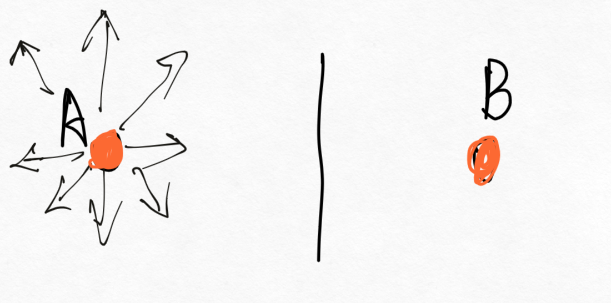
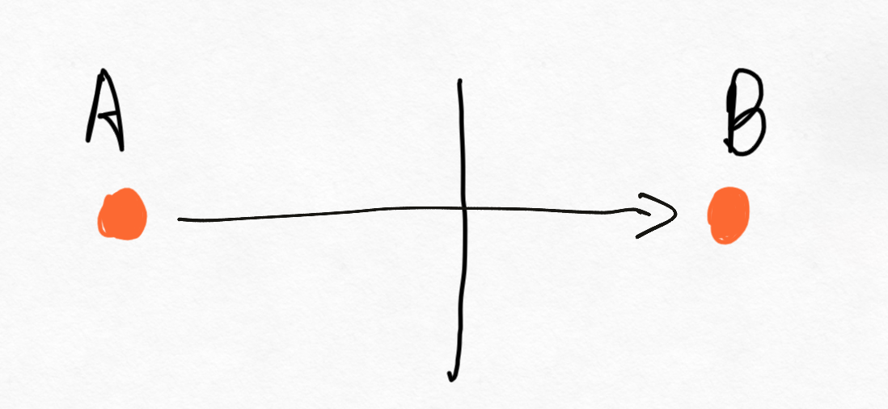
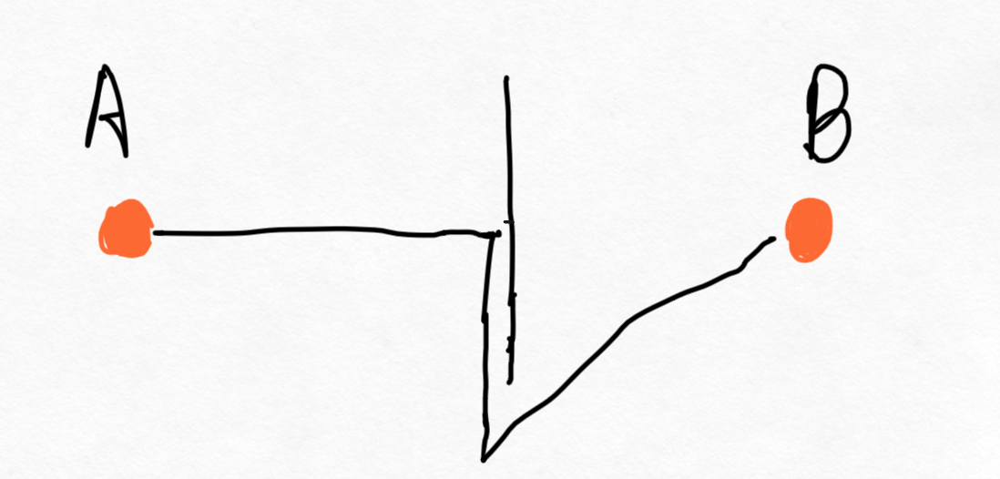
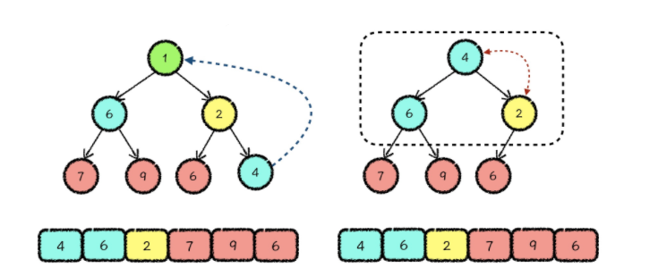
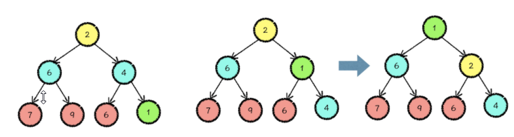
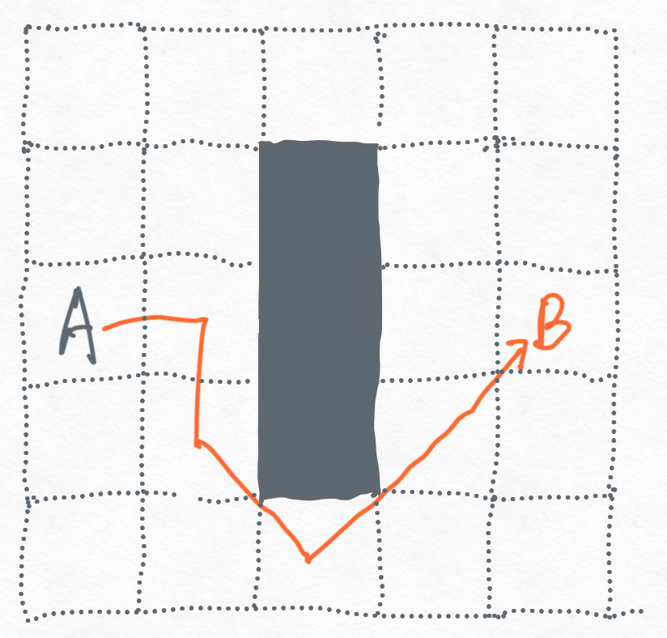
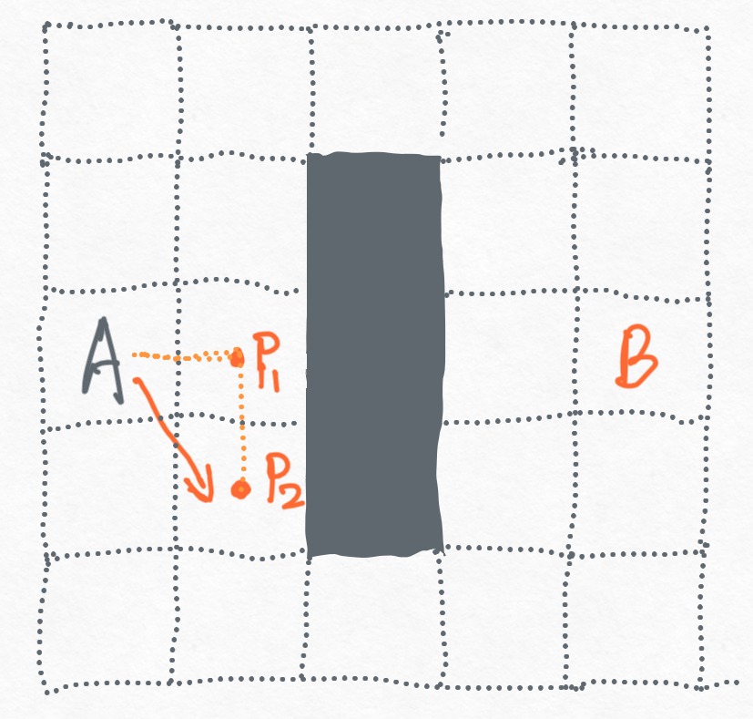
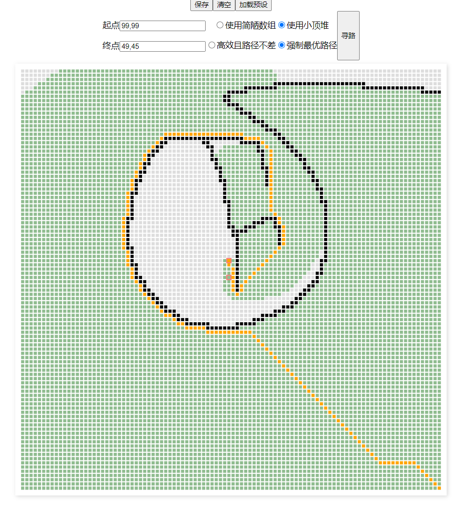
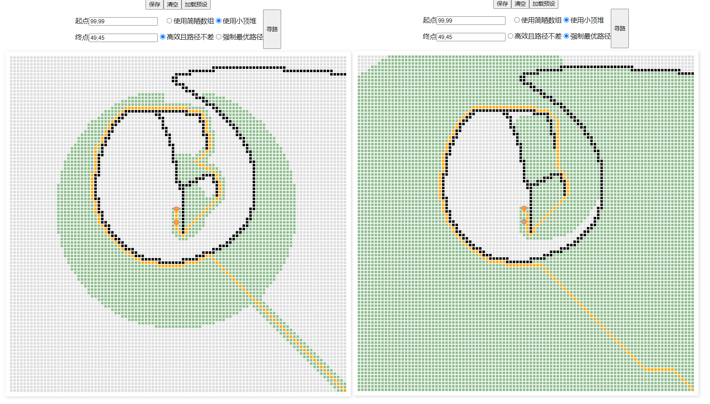

# 学习笔记

- [x] 1. 寻路 | [实现一个地图编辑器](./findPath/01.html)
  - 实现地图编辑效果
  - dom 改为了canvas, 10000 个dom节点 数量是有点大的
  - 新支持了仅点击也可以绘制和清除，用于精确控制点
- [x] 2. 寻路 | [广度优先搜索](findPath/02.html)
- [x] 3. 寻路 | [通过异步编程可视化寻路算法](findPath/03.html)
- [x] 4. 寻路 | [处理路径问题](findPath/04.html)
- [x] 5. 寻路 | [启发式搜索（一）](findPath/05.html)
- [x] 6. 寻路 | [启发式搜索（二）](findPath/06.html)
- [x] 7. 使用LL算法构建AST | 四则运算
- [x] 8. 使用LL算法构建AST | [正则表达式](LL/01.html)
- [x] 9. 使用LL算法构建AST | [LL词法分析](LL/02.html)
- [x] 10. 使用LL算法构建AST | [LL语法分析（一）](LL/03.html)
- [x] 11. 使用LL算法构建AST | [LL语法分析（二）](LL/04.html)

## 寻路问题

首先是将 dom 实现改为了 canvas , 单纯是考虑一万个节点节点已经算了比较大了，一般页面很少出现这么多的dom。使用 canvas 性能应该会好一些，而且鼠标位置到节点索引的推算也不会太复杂。

**路径获取**

地摊似的搜索，如果能搜到目标点，则表示可达。可对于寻路问题，需要的不仅仅是能不能到达，还需要到达的路径，走过的点可以记录下前一个点，这样再到达模板的时候，依次取出前一个点，不断重复知道起点即可得到起点到终点的路径，可参考[处理路径问题](findPath/04.html)

如图所示：


上面已经得到了路径，可是看到上面的结果中，虽然找到了路径，但是可以搜索过程还是比较低效的，如上图中，基本是将整个地图搜索了完了，才得到最终的路径。

**启发式寻路**

为了优化寻路的搜索，给的一个方案是启发式寻路。从出发点，可以走到下一步的一些位置，再下一步基于已经走过的点继续出发时，不在是随便拿一个点，而是会优先选择距离终点更近的点。这样可以大幅减小搜索的范围。

举个简单的例子，从A到B，大致如下：



之前是从A开始搜索，四面八方都开始走，直到到达B。



现在我们可以稍微聪明点，优先往B的方向走，遇到障碍不通的情况下再绕行，绕行选择时依然选择相对B更近的方向走。



加入方向选择之后，虽然路径并非最优，但实际让搜索的范围小了很多。下图是加了这种方向选择之后的结果，和最初的进行对比，可以看出走过的范围已经小了很多，也即搜索的范围缩小了很多。


实现这个的关键在于，下一次开始继续查找能走到哪里去的时候，优先选择一个距离终点最近的点。

课程04中实现是直接使用队列完成的，由于取的时候取出的就是对列头部的点，而队列本身无序，这就导致了搜索是一开始那样无序的，四面八方展开的并无方向指引。

如果我们能有一个有序的结构，能保障我们在取出点的时候，优先取到的是距离终点最近的点，那么实际就可以优化整个搜索过程。

完全有序的队列是用不到的，维护一个有序队列的成本也较高，因此课程中的实现是自定义了一下取的方法，取元素时，取出数组中最小的元素返回即可。课程中有实现并无特殊，只是去除元素的时候做了一个小技巧，没有使用 `splice` 删除找到的最小元素，而是记下需要取出的位置的元素，将数组最后的元素放在这个位置，再删除数组末位元素。这样的好处是避免了 `splice` 删除元素后的搬运操作。

```js
{
    take() {
        if (!this.data.length) return;

        let min = this.data[0];
        let minIndex = 0;
        let temp;
        for (let i = 1; i < this.data.length; i++) {
            temp = this.data[i];
            if (this.compare(temp, min) < 0) {
                min = temp;
                minIndex = i;
            }
        }

        // 将最后一个放到最小的位置 并删除最后一个即可
        this.data[minIndex] = this.data[this.data.length - 1];
        this.data.pop();
        return min;
    }
}
```

这个基于数组修改而成的数据结构基本是能用了，但是针对这种问题有没有更好的数据结构呢。

这里比较好的是**小顶堆**

可以[在此学习](https://time.geekbang.org/column/article/275747)

此处的堆和完全二叉树有关，小顶堆即：在一棵完全二叉树中，**每个父节点的值都要小于其两个子节点的值**。

接着分析下，为什么小顶堆最合适。

- 首先看取的情况： 由于任何的父节点都小于其两个子节点，那么在取的时候，堆顶元素必然就是最小的。直接可以得到最小元素。堆顶拿走后需要重新维护堆，由于小顶堆的的仅要求节点和其子节点的关系，那么堆顶拿走，最多需要调整的次数为：堆的层数（即二叉树的深度）。时间复杂度为： `O(logN)`。
- 接着看插入的情况，元素放置后，仍需维护小顶堆，最多需要调整的次数仍为堆的层数，也即 `O(logN)`。
  
以上来看小顶堆必然是比之前用的数组更为合适的。

小顶堆的一些性质和操作说明，以用数组存储说明

- 假设父节点下标为 `i` ，则其左子节点下标为 `2 * i + 1` , 右子节点下标为 `2 * i + 2`
- 加上当前节点下标为 `i` ，则其父节点下标为 `(i -1) / 2 >> 0`
- 堆的删除操作：
  - 图示：
  - 堆顶元素拿走
  - 堆的数组尾部元素拿走放在堆顶
  - 将堆顶作为父节点，开始检查。
    - 检查其和两个子节点的大小关系：
      - 如果父节点已经是最小的，则调整结束。
      - 否则选择较小的和父节点交换，交换后继续作为新的父节点继续检查。
  
- 堆的插入操作：
  - 图示：
  - 元素直接放置到堆存储数组的最后
  - 基于下标定位到先插入元素的父节点
  - 比较此父节点和新节点的大小关系
    - 若父节点小于新插入的节点，无需操作，结束
    - 若新节点更小，和父节点交换位置，重新定位父节点，继续调整。

使用最小堆作来存储已经走过的位置，可以完成上面的方向选择问题，优化搜索范围。

关于路径可以使用 `A*` 来继续优化, [https://blog.csdn.net/hitwhylz/article/details/23089415](https://blog.csdn.net/hitwhylz/article/details/23089415)

之前那我们只考虑了可走的点到终点的距离来比较，即完整的 `A*` 寻路中的 `H` 值，已经得到了一个相对不错的结果。

下面这张图是我代码写错的情况下得到的一个结果，可以看出路径已经有所优化，但仍并非最优。但是后面求出最优路径之后，我感觉下面这个结果还是不错的，原因后文分析。


完整的 `A*` 寻路，那篇文章讲解很详细了，不再赘述。重点描述如下：

- `G` 值，即起点移动到当前点的移动成本，当寻路完成时，到终点的G也就是找到的这条路径的长度。可在初始点直接标记为0，横纵移动时，标记递增1，斜着移动时标记递增1.4即可。为什么是1.4，即 √2
- `H` 值，即当前点到终点的直线距离，即课程中最开始就在比较的值。
- `F` 值，为 `G` 和 `H` 的和。最终是用这个值控制最先尝试的点。

和之前代码相比，要找最优路径的核心就是

1. 用 `F` 替代 `H` 作为优先下一步走的点的判断标准。
2. 遇到已经走过的点时，检查前置节点。

至于为什么可以这么理解，将上面的A到B的问题具体化，根据前面只判断距离应该是下面这种情况：



基于前面的经验

1. 第一次开始尝试时，会加入A周围的点，其中包括了p1和p2，
2. 当从 p1 出发，开始检查 p2 时发现 p2 已经走过，之前是直接忽略了，这就导致了先到p1，再到p2，从而非常直观的就不是最优路径了。
   - 现在需要进一步检来检查来调整路径。
   - 我们注意观察 p2 已经走过（广度搜索第一步A出发），其G值为 1.4 (0 + 1.4)
   - 而 p1 到 p2 的 G 为 1，再加上由 A 到 p1 的 1，总的 G 为 2
   - 从而从 p1 到 p2 不是好选择，应该直接由 A 到 p2


代码可参考  [启发式搜索（二） 中的 `findPathPerfect`](findPath/06.html) 

效果如下：



不过寻得最优路径的情况下，查询范围又变大了不少，不过比最初的结果还是好上不少。

因此个人觉得上面那个并非最优的路径的情况还是非常不错了，因为毕竟查询范围小了很多很多。是否需要最优路径可以根据实际情况再做取舍。



## LL 构建 AST

**tokens**


**Expression**


### 正则表达式

```js
/([0-9\.]+)|([ \t]+)|([\r\n]+)|(\*)|(\/)|(\+)|(\-)/g
```

上面的正则，乍一看好长，都是符号，一脸蒙的情况。但是细读一下，其实也不算太难，并列的七个分组，分别表示 `0~9和.` `空格和制表符 ` `换行符` `*` `/` `+` `-` 。

不过虽然能看懂，但是还是真的难读，这里推荐结合可视化正则来理解，比如下变成下面这样是是不是可读性高了很多：

[](https://fe.epoint.com.cn/regexp/#%2F%28%5B0-9%5C.%5D%2B%29%7C%28%5B%20%5Ct%5D%2B%29%7C%28%5B%5Cr%5Cn%5D%2B%29%7C%28%5C*%29%7C%28%5C%2F%29%7C%28%5C%2B%29%7C%28%5C-%29%2Fg)

### 词法分析

此节重点在前一节的基础上将匹配到的 token 进行组织，并加入了多次匹配中间是是否存在不认识的字符的判断。

关于是否存在不认识的字符，课程中是用了正则对象上的 `lastIndex` 并自己记录一个上次匹配之后的 `lastIndex` 二者进行比较，若新的扣去匹配到的长度小于上一次的，则标识两次匹配之间存不认识的字符。token 解析失败。

上面是从结束位置的考虑，这里还有一种方式，即正向的，我们做 token 解析要求就解析的字符串中必须都是认识的字符，也即匹配必须连续。因此可以可以直接做下一次的开始位置必须要等于上一次位置加上一次匹配长度的判断。伪代码如下：

```js
let index = 0; // 记录匹配开始索引
while (true) {
    result = regexp.exec(source);
    if (!result) break;

    // 若匹配到的位置和预期开始位置不一致 则存在不认识的字符
    if (index != result.index) {
        throw new Error(`unknown token at ${index} , 【${source[index]}】 is unknown`)
        break;
    }
    // 更新下次匹配应该的开始位置
    index += result[0].length;
}
```

另外，进行匹配的这个 `regexp` 最好应该是 `tokenize` 函数的局部变量。考虑连续进行匹配，上一次匹配可能存在不认识字符导致错误的情况。 如果正则是外部变量，第一次匹配在并非正则匹配完成结束而是存在不认识代码结束的情况下，正则上的 `lastIndex` 仍为上次失败时的位置。而第二次匹配时仍然使用的是外部的那个正则，从而导致第二次的匹配受到影响。当然在匹配失败的时候手动修复也是可以的。

可以尝试如下代码，可以将可以看到由于第一次存在不认识的字符串 `A`, 匹配结束，但是匹配的位置停在了 `A10`之后，导致第二次匹配时，只匹配到了 `空白 * 空白 * 25` 前面的内容丢失。

```js
const regexp = /([0-9\.]+)|([ \t]+)|([\r\n]+)|(\*)|(\/)|(\+)|(\-)/g;
const dictionary = ['Number', 'Whitespace', 'LineTerminator', '*', '/', '+', '-'];
function* tokenize(source) {
    // const regexp = /([0-9\.]+)|([ \t]+)|([\r\n]+)|(\*)|(\/)|(\+)|(\-)/g;

    let result = null;
    let lastIndex = 0;// 记录上一次匹配完成的结束索引
    console.log('input', source);
    while (true) {
        lastIndex = regexp.lastIndex;
        result = regexp.exec(source);
        if (!result) break;
        // 新的匹配的 结束位置 - 上一次的结束位置 > 当前匹配 则标识当前匹配和上一次匹配之间存在不认识的字符
        if (regexp.lastIndex - lastIndex > result[0].length) {
            throw new Error(`unknown token at ${lastIndex} , 【${source[lastIndex]}】 is unknown.`)
            break;
        }

        const token = { type: '', value: '' };

        for (let i = 1; i <= dictionary.length; i++) {
            if (result[i]) {
                token.type = dictionary[i - 1];
            }
        }
        token.value = result[0];
        yield token;
    }
}
try {
    for (let t of tokenize('1024 + A10 * 25')) {
        console.log(t);
    }
}catch (err) {console.error(err)}
try {
    for (let t of tokenize('1024 +  10 * 25')) {
        console.log(t);
    }
}catch (err) {console.error(err)}
```

### 语法分析

都看懂并跟着实现了，却还没搞懂为什么要这么思考这么做。

:::
TODO
:::