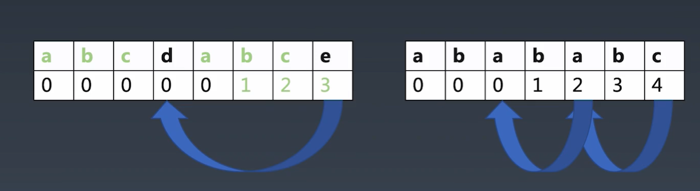
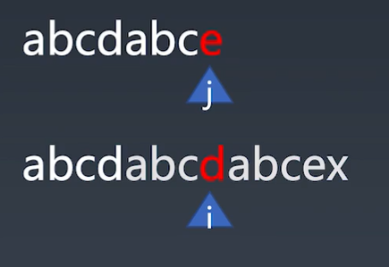
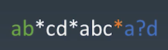

# week3

[🔙](../)

1. [week3](#week3)
   1. [字典树](#字典树)
   2. [kmp](#kmp)
   3. [Wildcard](#wildcard)
   4. [reactive](#reactive)
   5. [Range 拖拽](#range-拖拽)

## [字典树](trie/index.html)

即 trie ，以树状结构存储每个位置的字符，便于统计出现次数最多的字符串。

## [kmp](kmp/index.html)

在字符串中寻找是否包含特定子串，kmp 实际是对暴利解法的一种优化，常规暴力解法从查找源的开始位置和 pattern 逐个比对，若存在不匹配则直接回退位置重新开始。而实际上可以不必回到开始位置重新匹配。以下图为例：

当源中的 i 和 pattern 的 j 位置进行比对时，发现不匹配，暴力解法会直接重置i、j开始新一轮。而实际上，匹配能走到 j 的位置，表示了 j 前面的位置都是匹配上的。回退位置并非一定要重新开始。上面的 pattern 中存在 abc 的重复，因此当 j 的位置不匹配时，前面的abc是匹配的，可以将 j 回退到 d 的位置继续匹配。若d仍不匹配则才会再回退的开始位置重新开始。

因此 kmp 的核心则是计算 pattern 中每个字符位置的回退情况。下图是回退示例：



第一个 pattern 中存在 abc 的重复，若第二个 b 位置出现不匹配则可以回退到第一个b的位置即下标为1的位置，第二个c出现不匹配时可回退到第一个c的位置即下标2， ……

第二个pattern 中存在 ab 的重复，最后一个 c 的位置出现不匹配时，首先可回退至下标为4的a位置继续匹配，若仍不符合则可以继续回退到下标为2的位置继续匹配，直到回退表格中记录为0的位置才需要从头开始。



**[带 `?` 通配符的 kmp](kmp/index2.html)**

后面的 Wildcard 中间内容会可以用到一个带 ? 通配符的 kmp ， 实际要对 kmp 做的调整非常小，只用在计算跳转表格和进行匹配时，将 pattern 中为 ? 的位置认为符合即可。

## [Wildcard](wildcard/index.html)

即带通配符的字符串匹配。

`*` 最后的位置上的和其他位置上的不同，最后位置的尽可能多的匹配，其他的位置的尽可能少的匹配



如图，将模式分为三部分:

1. 前面的直接匹配， 逐个字符处理即可
2. 中间白色的当成 kmp 处理，即寻找字符串中是否存在特定子串。
3. 最后的再单独处理最后一组带 `*` 的组，从后往前匹配即可

使用 带 `?` 的 kmp：

```js
// #region 带 ? 的 kmp 方案
let kmpResult = kmp(source.substr(lastIndex), subPattern);
if (!~kmpResult) {
   // kmp 匹配失败则结束
   return false;
}
// 否则下次开始位置 向后移动
lastIndex += kmpResult + subPattern.length;
// #endregion
```

使用正则

```js
// #region 正则方案
// 尝试将 ? 转化为正则的任意字符 并进行正则匹配
let reg = new RegExp(subPattern.replace(/\?/g, '[\\s\\S]'), 'g');
reg.lastIndex = lastIndex;
let result = reg.exec(source);
console.log(result);
if (!result) {
   return false;
}
lastIndex = reg.lastIndex;
// #endregion
```

## [reactive](reactive/index.html)

比 `Object.defineProperty` 更完善的进阶版，可拦截代理更多的行为，不仅仅局限于 get 和 set

## [Range 拖拽](range/index.html)

