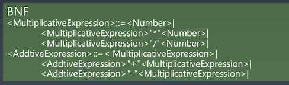
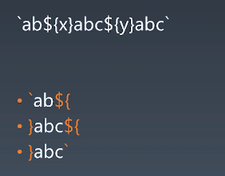

# week04

[🔙](../)

1. [week04](#week04)
   1. [**带括号的四则运算**](#带括号的四则运算)
   2. [计算机语言分类](#计算机语言分类)
   3. [string utf8 编码](#string-utf8-编码)
   4. [JavaScript 去设计狗咬人的代码](#javascript-去设计狗咬人的代码)
   5. [JavaScript 标准里面所有具有特殊行为的对象](#javascript-标准里面所有具有特殊行为的对象)
   6. [课堂内容摘要](#课堂内容摘要)
   7. [String](#string)

## **带括号的四则运算**

```
<BracketExpression>::=<Number>|
  "("<AddtiveExpression>")"|
<AddtiveExpression>::=<MultiplicativeExpression>|
  <AddtiveExpression>"+"<MultiplicativeExpression>|
  <AddtiveExpression>"-"<MultiplicativeExpression>|
<MultiplicativeExpression>::=<BracketExpression>|
  <MultiplicativeExpression>"*"<BracketExpression>|
  <MultiplicativeExpression>"/"<BracketExpression>|
​
```

## 计算机语言分类

**形式语言——用途**

- 数据表述语言： HTML XML JSON SQL CSS
- 编程语言： C C++ C# VB java javascript TypeScript Dart php python ruby go Swift 

**形式语言——表达方式**

- 声明式语言： HTML XML JSON SQL CSS
- 命令式语言： C C++ C# VB java javascript TypeScript Dart php python ruby go Swift

## string utf8 编码

1. 0~127 仅占用1字节
2. 0080 ~ 07FF 2 字节 对应 `110xxxxx  10xxxxxx` 将码点填入即可
3. 0800 ~ FFFF 3 字节 对应 `1110xxxx 10xxxxxx 10xxxxxx` 将码点填入即可

将字符码点进行补位填充时，需要用到二进制的相关运算，以 `一` 为例做解释说明：

| 汉字 | 码点  | 二进制          |
| ---- | ----- | --------------- |
| 一   | 19968 | 100111000000000 |

需要三字节， 以 `1110xxxx 10xxxxxx 10xxxxxx` 其中x有16位，但 19968 的二进制 `100111000000000` 仅 15 位，前面补 0 得到 `0100 111000 000000`

- 取前四位填入第一个字节, 得到 `1110 0100`。
  - 共计16位，取前4位，则右移12位即可，
  - 前面需要补 `1100 xxxx` 则和 `11000000`(192) 按位或即可。(因为前面的`11000000` 后面都是0，而经过移位运算截取的前四位的前面都是0)
- 取中间六位填入第二个字节, 得到 `10 111000`。
  - 采用类似方案，先右移6位去掉尾部的6位。
  - 前面的的怎么去掉呢？直接和 `111111`(63) 按位与即可，因为我们只要中间的6位，移位之后是目前的最后6位，按位与要求都是1才会是1，这样就把前面的也都变成了0，相当与仅保留了最后六位
  - 前面补 `10xx xxxx` 则和 `10000000`(128) 按位或即可
- 取最后六位填入第三个字节, 得到 `10 000000`
  - 取后六位直接和 `111111`(63) 按位与即可
  - 前面补 `10xx xxxx` 则和 `10000000`(128) 按位或即可

即得到 `[1110 0100, 10 111000, 10 000000]` 即 `[228, 184, 128]`

```js
/**
 * utf8 编码 仅支持0000~FFFF范围的
 * @param {string} str
 */
function encodeUtf8(str) {
    const arr = [];

    for (let i = 0; i < str.length; i++) {
        // const char = str[i];
        const point = str.charCodeAt(i);

        // 0 ~ 127 占用1字节
        if (point < 128) {
            // 0000 ~ 007F
            arr.push(point);
        } else if (point < 2048) {
            // 0080 ~ 07FF 2 字节
            // 110xxxxx  10xxxxxx
            arr.push((point >> 6) | 192); // 110 + 前5位
            arr.push((point & 63) | 128); // 10 + 后6位
        } else if (point <= 0xffff) {
            // 0800 ~ FFFF 3 字节
            // 1110xxxx 10xxxxxx 10xxxxxx
            arr.push((point >> 12) | 224); // 1110 + 前4位
            arr.push(((point >> 6) & 63) | 128); // 10 + 中间6位
            arr.push((point & 63) | 128); // 10 + 后6位
        }
    }

    return Buffer.from(arr);
}

var str = '一二';
console.log(encodeUtf8(str));
console.log(Buffer.from(str, 'utf8'));
```

## JavaScript 去设计狗咬人的代码

**核心点**： 狗咬人，改变的是人的状态，因此不应该出现在狗的身上。

因此结构应是如下，人会受到伤害，伤害是由狗产生的。 因此需要一个中间类 —— 伤害。

```js
class Animal {}

class Dog extends Animal {}

class Human extends Animal {
    harm(something) {
        console.log(something, `harm human`);
    }
}

class Damage {}
```

必要地方补充完善如下：
 
```js
class Animal {}

class Damage {
    constructor(from) {
        this.from = from;
    }
}
class Dog extends Animal {
    /**
     * 狗咬的行为 返回一个伤害对象
     */
    bite() {
        return new Damage(this);
    }
}

class Human extends Animal {
    /**
     * 人受到伤害
     * @param {Damage} someDamage 某种伤害，可以是被狗咬，被人骗，被砖头砸
     */
    harm(someDamage) {
        console.log(someDamage, `harm human`);
    }
}

// test
const dog = new Dog();
const zs = new Human();

zs.harm(dog.bite());
// Damage {from: Dog} harm human
```

## JavaScript 标准里面所有具有特殊行为的对象

- `Array`
  - `length` 属性，自动更新，且可以赋值来改变数组
- `String`
  - 下标访问
  - 不可变性
- `Arguments`
  - `callee` 可获取到调用函数
  - `length` 为传入参数个数
- `Function`
  - `length` 对应形参长度
  - `call`, `apply` 在调用的同时，可改变方法内this指向，调整参数形式
  - `bind` 基于旧方法产生绑定新this指向的新方法

## 课堂内容摘要

乔姆斯基谱系：是计算机科学中刻画形式文法表达能力的一个分类谱系，是由诺姆·乔姆斯基于 1956 年提出的。它包括四个层次：

1. 0- 型文法（无限制文法或短语结构文法）包括所有的文法。
1. 1- 型文法（上下文相关文法）生成上下文相关语言。
1. 2- 型文法（上下文无关文法）生成上下文无关语言。
1. 3- 型文法（正规文法）生成正则语言。

产生式： 在计算机中指 Tiger 编译器将源程序经过词法分析（Lexical Analysis）和语法分析（Syntax Analysis）后得到的一系列符合文法规则（Backus-Naur Form，BNF）的语句

巴科斯诺尔范式：即巴科斯范式（英语：Backus Normal Form，缩写为 BNF）是一种用于表示上下文无关文法的语言，上下文无关文法描述了一类形式语言。它是由约翰·巴科斯（John Backus）和彼得·诺尔（Peter Naur）首先引入的用来描述计算机语言语法的符号集。

终结符： 最终在代码中出现的字符（ https://zh.wikipedia.org/wiki/ 終結符與非終結符)



## String

可再参考[通过javascript进行UTF-8编码](https://www.cnblogs.com/doublenet/p/5616451.html)

新的 \` \` 实际产生了四种 token



同时 \` 前面还可以是函数名
