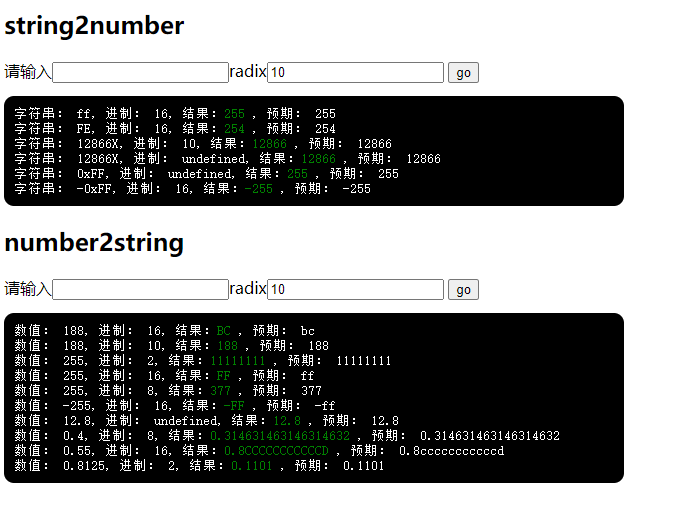
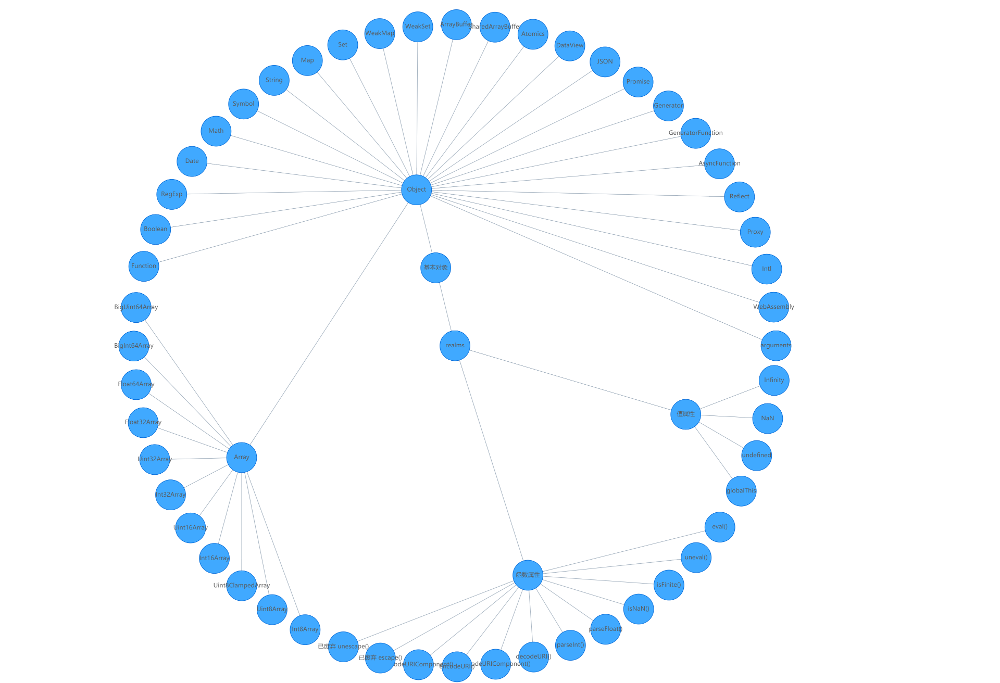

# week05

## 类型转换

[实现](./02/index.html)

## reaml

参考资料

- [https://developer.mozilla.org/zh-CN/docs/Web/JavaScript/Reference/Global_Objects](https://developer.mozilla.org/zh-CN/docs/Web/JavaScript/Reference/Global_Objects)
- [https://github.com/tc39/proposal-realms](https://github.com/tc39/proposal-realms)

[可视化展示](./07/index.html)

